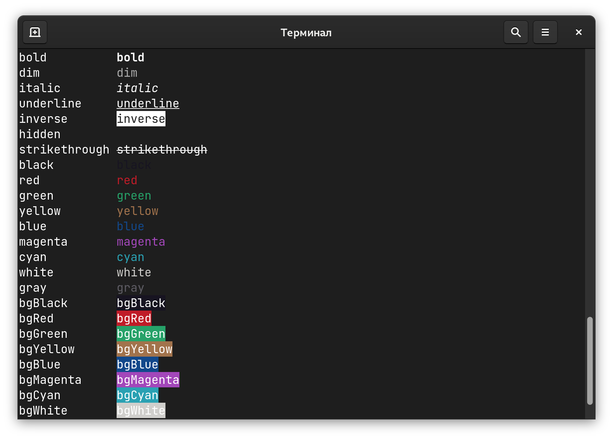

# Nano Colors


A tiny and fast Node.js library to ANSI colors to terminal output.

>Started as a fork
> of [**@jorgebucaran**](https://github.com/jorgebucaran/)’s
> [`colorette`](https://github.com/jorgebucaran/colorette) with hacks
> from [**@lukeed**](https://github.com/lukeed/)’s
> [`kleur`](https://github.com/lukeed/kleur).
> See [changes](https://github.com/ai/nanocolors/wiki/Colorette-Changes)
> between Nano Colors and `colorette`.

* It is **4 times faster** than `chalk` for simple use cases.
* **No dependencies.** It takes **5 times less space** in `node_modules`
  than `chalk`.
* **Actively maintained.** Used in many big projects
  like PostCSS or Browserslist.
* **Auto-detects color support.** You can also toggle color mode manually.
* **Tree-shakable.** We use a dual [ESM]/[CJS] package.
* Supports Node.js ≥ 6 and universal Node.js/browser projects.

```js
import { green, bold } from 'nanocolors'

console.log(
  green(`Task ${bold('1')} was finished`)
)
```

<p align="center">
  
</p>

<a href="https://evilmartians.com/?utm_source=nanocolors">
  
</a>

[ESM]: https://github.com/ai/nanocolors/blob/main/index.js
[CJS]: https://github.com/ai/nanocolors/blob/main/index.cjs


## Benchmarks

Benchmark for simple use case:

```
$ ./test/simple-benchmark.js
chalk         10,242,983 ops/sec
cli-color        723,530 ops/sec
ansi-colors    3,604,458 ops/sec
kleur         13,086,656 ops/sec
kleur/colors  15,955,740 ops/sec
colorette     41,579,227 ops/sec
felt-pen      13,569,353 ops/sec
nanocolors    40,832,014 ops/sec
picocolors    41,452,209 ops/sec
```

Benchmark for complex use cases:

```
$ ./test/complex-benchmark.js
chalk          1,937,337 ops/sec
cli-color        310,769 ops/sec
ansi-colors      726,024 ops/sec
kleur          1,241,189 ops/sec
kleur/colors   1,685,363 ops/sec
colorette      1,867,842 ops/sec
felt-pen       2,211,771 ops/sec
nanocolors     2,693,805 ops/sec
picocolors     4,037,949 ops/sec
```

Library loading time:

```
$ ./test/loading.js
chalk          3.465 ms
cli-color     21.849 ms
ansi-colors    1.101 ms
kleur          1.628 ms
kleur/colors   0.508 ms
colorette      1.034 ms
felt-pen       0.405 ms
nanocolors     0.486 ms
picocolors     0.470 ms
```

The space in `node_modules` including sub-dependencies:

```
$ ./test/size.js
Data from packagephobia.com
chalk         101 kB
cli-color    1249 kB
ansi-colors    25 kB
kleur          21 kB
colorette      16 kB
felt-pen       10 kB
nanocolors     16 kB
picocolors     10 kB
```

Test configuration: ThinkPad X1 Carbon Gen 9, Fedora 34, Node.js 16.10.

## Replacing `chalk`

1. Replace import and use named exports:

   ```diff
   - import chalk from 'chalk'
   + import { red, bold } from 'nanocolors'
   ```

2. Unprefix calls:

   ```diff
   - chalk.red(text)
   + red(text)
   ```

3. Replace chains to nested calls:

   ```diff
   - chalk.red.bold(text)
   + red(bold(text))
   ```

Above changes can be applied automatically using
[codemod](https://gist.github.com/gavrix/ff051941ad9a19c8ea3224f38c30bc9a):

```sh
npx jscodeshift FILES -t https://gist.githubusercontent.com/gavrix/ff051941ad9a19c8ea3224f38c30bc9a/raw/09d81e93f880ecbc8f52dcf7819816c81e2ba340/chalk_nanocolors_transform.js
```

## API

### Individual Colors

Nano Colors exports functions:

| Colors    | Background Colors   | Modifiers         |
| --------- | ------------------- | ----------------- |
| `black`   | `bgBlack`           | dim               |
| `red`     | `bgRed`             | **bold**          |
| `green`   | `bgGreen`           | hidden            |
| `yellow`  | `bgYellow`          | _italic_          |
| `blue`    | `bgBlue`            | <u>underline</u>  |
| `magenta` | `bgMagenta`         | ~~strikethrough~~ |
| `cyan`    | `bgCyan`            | reset             |
| `white`   | `bgWhite`           |                   |
| `gray`    |                     |                   |

Functions are not chainable. You need to wrap it inside each other:

```js
import { black, bgYellow } from 'nanocolors'

console.log(bgYellow(black(' WARN ')))
```

Functions will use colors only if Nano Colors auto-detect that current
environment supports colors.

You can get support level in `isColorSupported`:

```js
import { isColorSupported } from 'nanocolors'

if (isColorSupported) {
  console.log('With colors')
}
```


### Conditional Support

You can manually switch colors on/off and override color support auto-detection:

```js
import { createColors } from 'nanocolors'

const { red } = createColors(options.enableColors)
```

On `undefined` argument, `createColors` will use value
from color support auto-detection.
